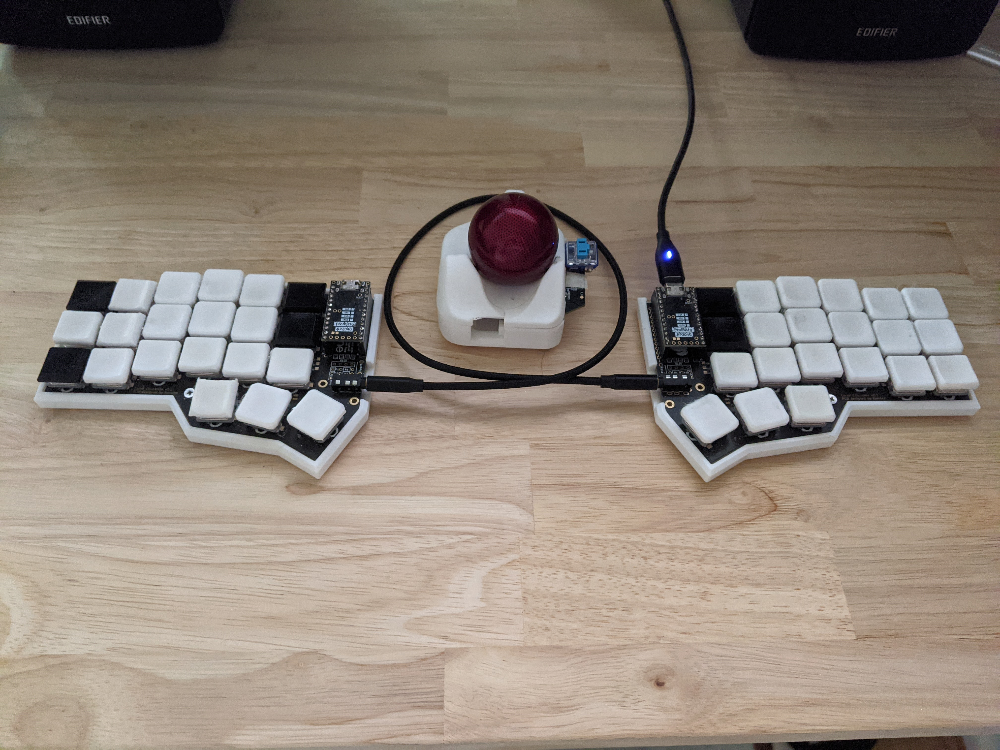

> :warning: **Warning:** This is currently a work in progress - things are probably a bit/very broken. Use at your own peril.

There are a few tutorials floating around that show you how to convert a mouse into a trackball really cheaply. Most of these tutorials are incomplete.
This repository adds to these, with the intent of building a trackball (re)using cheap and readily available parts and existing software.

I've been using this as my daily pointing device for the past two months and it works well enough for my needs.  Your mileage may vary.

The repository is divided into two parts:
1. The hardware - 3D printed parts, PCB, buttons etc.
2. The software - links and information relating to jfedor's amazing work

## Requirements
* Basic soldering (for battery terminals, button(s), and HID remapper)
* Access to a 3D printer or 3D printing services
* New and/or second-hand parts
  * Original Xiaomi portable mouse (I think the model number is XMSBO1MW)
  * 40mm Trackball ball (I used the one from a Logitech marble)
  * Bearings (MR63ZZ)
  * (Optional) button
  * A [HID remapper](https://github.com/jfedor2/hid-remapper) by [jfedor2](https://github.com/jfedor2) including RP2040 and USB-A female port
